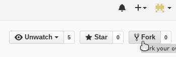
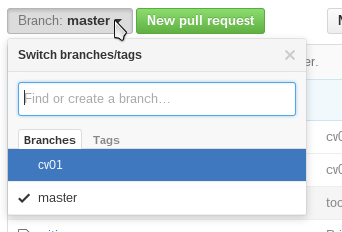
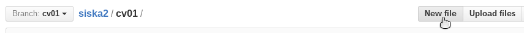
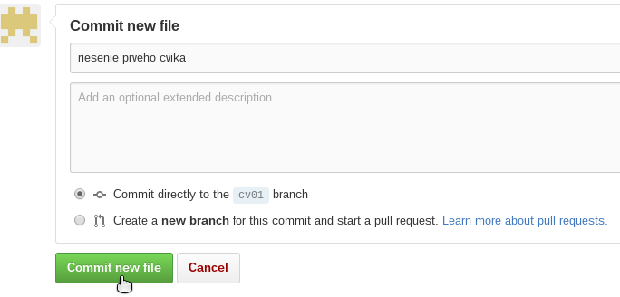
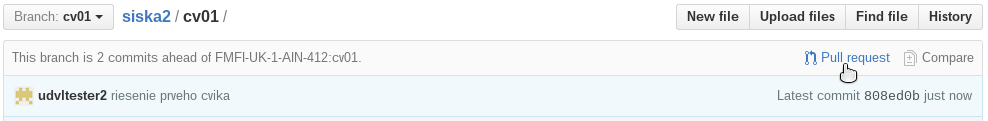
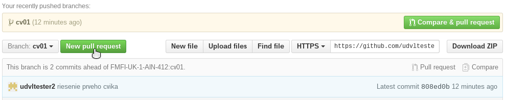
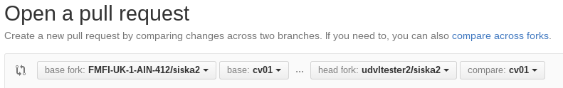
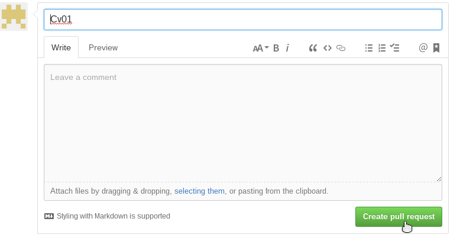
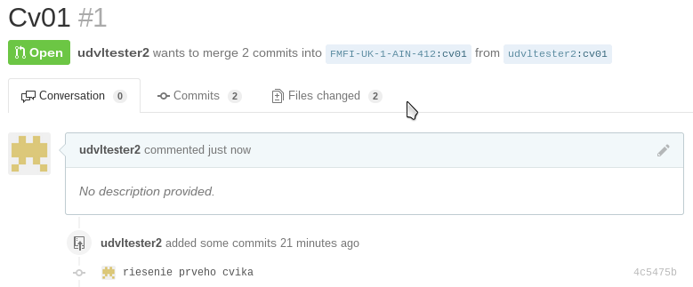

Odovzdávanie
============

Ak nie je v zadaní cvičenia alebo domácej úlohy povedané ináč,
riešenie sa odovzdáva na GitHub-e podľa nasledovných inštrukcií.


Na GitHub-e máte (ak ste poslali správny mail) v rámci organizácie
[FMFI-UK-1-AIN-412](https://github.com/orgs/FMFI-UK-1-AIN-412)
súkromný repozitár na odovzdávanie úloh s rovnakým názvom ako je vaše prihlasovacie
meno do AISu (viete sa k nemu dostať cez adresu
`https://github.com/FMFI-UK-1-AIN-412/priezviskoCISLO`, tiež by ste ho mali vidieť,
keď sa prihlásite na github).

**Aby ste mohli do tohoto repozitára nahrávať riešenie, musíte si ho úplne prvý krát
`fork`-núť pod svojho používateľa.** Riešenia potom nahrávate do tohoto svojho forku a
odovzdáte ich tým, že vyrobíte pull request.



Odovzdanie konkrétneho riešenia pozostáva z dvoch krokov:
- [Nahrať](#nahranie-riešenia) vaše riešenie na GitHub do vášho repozitára
  do správnej vetvy (`branch`).
- [Vytvoriť _Pull request_](#vytvorenie-pull-requestu) na tej vetve, čím
  riešenie naozaj odovzdáte.  V tomto vytvorenom requeste sa objavia
  prípadné komentáre k vášmu riešeniu, ako aj finálne bodové ohodnotenie.

**Pri odovzdávaní nezabudnite dodržať [formát riešenia](#formát-riešenia).**

## Nahranie riešenia

Ak ste už pracovali s git-om, nemalo by to byť nič ťažké. *Ak ste s git-om
nikdy nepracovali, absolútne s ním nechcete mať nič spoločného a potrebujete
odovzdať len jeden / dva súbory, použite prvú možnosť
([nahrávanie cez web](#nahrávanie-cez-web))*,
ale skúste si aspoň prečítať nasledujúce odstavce, aby ste mali predstavu,
čo sa vlastne deje.

Git uchováva súbory a ich zmeny prostredníctvom `commit`-ov. Každý `commit`
môže obsahovať informácie o zmenách vo viacerých súboroch (zmena je aj
vytvorenie nového súboru). `commit`-y sú organizované vo vetvách (branch),
pričom vetva je vlastne postupnosť `commit`-ov (zmien).

Git rozlišuje vašu lokálnu verziu repozitára a tú na serveri. Keď vytvoríte
`commit`, vytvoríte ho iba na svojom lokálnom počítači (v aktuálnej vetve). Ak
chcete aby sa objavil na serveri, musíte naň svoju aktuálnu vetvu nahrať (`push`). Ak
sa na serveri objavia nové commity, musíte si ich stiahnuť do svojej lokálnej
kópie (`pull`).

Každé zadanie bude hovoriť do akej vetvy (branch) máte svoje riešenie nahrať.
Pre cvičenia to budú zvyčajne vetvy `cvXX`. Na to musíte:

1. najskôr zo serveru stiahnuť aktuálnu verziu tej vetvy (bude v nej zadanie,
   ktoré sme tam nahrali, keď sme ho zverejnili),
2. prepnúť sa na ňu (ak nie je aktívna),
3. vytvoriť vaše riešenie,
4. `commit`-núť ho a
5. nahrať novú verziu vetvy naspäť na server.

Možnosti:
- [Nahrávanie cez web](#nahrávanie-cez-web)
- [GitHub aplikácia](#github-aplikácia)
- [Git commandline](#git-commandline)
- TODO Git GUI

### Nahrávanie cez web

Najskôr potrebujeme otvoriť správnu vetvu (branch), do ktorej máme
riešenie uložiť (napr `cv01`). Jedna možnosť je jednoducho otvoriť váš súkromný
repozitár a prepnúť sa na správnu vetvu:



Druhá možnosť je priamo otvoriť správne url:

`https://github.com/VasGithubLogin/VasAisLoginCISLO/tree/cv01`

Nezabudnite správne prepísať `VasGithubLogin` a `VasAisLoginCISLO` a takisto `cv01` na vetvu,
do ktorej potrebujete nahrať riešenie.

Následne prejdite do správneho adresára (t.j. `cv01`) a kliknite na ikonu na
vytvorenie nového súboru:



Otvorí sa Vám formulár, kde môžete zadať meno súboru a napríklad skopírovať
jeho obsah:


Následne napíšte krátku správu / poznámku a odošlite:



Ak potrebujete odovzdať viacero súborov, jednoducho postup opakujte.
Keď sú všetky nahraté, pokračujte [vytvorením pull requestu](#vytvorenie-pull-requestu).

*Hint*: po odoslaní súboru, ste na stránke, kde môžete rovno vyrobiť [pull
request](#vytvorenie-pull-requestu) zo správnej vetvy:




### GitHub aplikácia

GitHub ma vlastnú windows aplikáciu, ktorá je možno trošku jednoduchšia na
používanie ako čistý git:

http://windows.github.com/

Možno časom pribudne aj nejaký podrobnejší návod k nej.

### Git commandline

V Linuxe / OS X stačí otvoriť terminál (v adresári, kde chcete mať
repozitár), vo Windows po nainštalovaní git-u by sa v context menu pre
adresár (pravé tlačítko myši) mala objaviť možnosť otvoriť „Git Shell“.

Úplne prvýkrát je treba naklonovať repozitár (nezabudnite `VasGithubLogin
a VasAisLoginCISLO` nahradiť vašimi prihlasovacími údajmi):

```sh
git clone git@github.com:VasGithubLogin/VasAisLoginCISLO.git
```

Pri každom odovzdávaní riešenia stačí potom robiť nasledovné kroky:
```sh
# vojdeme do repozitara
cd VasAisLoginCISLO

# stiahneme si zmeny zo serveru
git fetch

# nastavime sa na spravnu vetvu/branch
git checkout cv01

# vytvorime / nakopirujeme riesenie (do spravneho adresara)
vim cv01/cv01.cpp

# commitneme
git status    # vypise, ze cv01/cv01.cpp ma zmeny / je novy subor
git add cv01/cv01.cpp    # treba zopakovat pre kazdy dalsi subor, ktory odovzdavame
git status    # vypise, ze ide commitnut zmeny v cv01/cv01.cpp
git commit -m "moje riesnie"
git status    # vypise, ze uz nie su ziadne necommitnute zmeny

# nahrame na server (spravnu branch)
git push origin cv01
```

Na GitHub-e by sa teraz mala objaviť vaša zmena, možete si ju pozrieť
napríklad cez históriu vetvy `cv01`:

`https://github.com/VasGithubLogin/VasAisLoginCISLO/commits/cv01`

Ak zistíte, že ešte potrebujete spraviť nejaké ďalšie zmeny, môžete
jednoducho vyrobiť ďalšie commit-y a znovu ich nahrať:

```sh
vim cv01/cv01.cpp
git add cv01/cv01.cpp
git commit -m "opravena chybicka"
git push origin cv01
```

## Vytvorenie Pull Requestu

Každé zadanie bude hovoriť, do ktorej vetvy (branch) máte svoje riešenie nahrať
(napríklad `cv01`). Aby ste ho skutočne odovzdali, musíte vytvoriť pull request
z tejto vetvy (`cv01`) z vášho repozitára (`VasGithubLogin/VasAisLoginCISLO)
do nášho repozitara (FMFI-UK-1-AIN-412/VasAisLoginCISLO).

Najskôr potrebujeme otvoriť Vašu vetvu: otvorte Váš súkromný repozitár a prepnite
sa na správnu vetvu:


Tlačítok na vytvorenie pull requestu je vždy viac než dosť:



GitHub Vám ukáže, k akým zmenám sa chystáte vytvoriť pull request (malo by to
byť pridanie Vášho riešenia).  Skontrolujte, pre ktorú vetvu vytvárame pull
request (`cv01`), a kliknite `Create Pull Request`:



V ďalšom kroku môžete vyplniť krátky komentár, predvyplnená je správa z
posledného commitu.  Neváhajte napísať komentáre k Vášmu riešeniu. Odovzdanie
ukončíte stlačením tlačidla `Create pull request`:



Po odoslaní sa vám ukáže novovytvorený pull request. Časom sa v ňom objavia
komentáre s vaším hodnotením:



Poznámka: aj po otvorení pull requestu možete ďalej nahrávať zmeny do vetvy, z
ktorej ste ho urobili (t.j. `cv01`). Tie sa automaticky objavia v pull requeste
(GitHub vam umožní pridávať ich aj po termíne, ale tie zmeny už nebudú
hodnotené).

## Formát riešenia

Aby ste mali cvičenia ohodnotené čo najrýchlejšie a aby sme pri opravovaní
nemuseli strácať čas a psychické sily babraním sa so zdrojákmi, je potrebné
aby ste dodržali nasledovné pravidlá týkajúce sa odovzdávania zdrojákov.

## Všeobecné pravidlá

- Každé cvičenie odovzdáte v správnom adresári (t.j. `cv01` atď).
- Odovzdávate iba zdrojové súbory (žiadne binárky, súbory vygenerované počas
  kompilovania a pod.)
- Súbory budú priamo v zadanom adresári (nie v podadresári)
- Všetky zrojové súbory sú v tom istom jazyku.
- Kód musí byť skompilovateľný a spustiteľný nižšie uvedenými inštrukciami.
- Cvičenia môžete riešiť v jazykoch C, C++, Python a Java. Iný jazyk môžete
  použiť po prekonzultovaní a schválení cvičiacim.
- Ako bude program dostávať vstup a ako vracať výstup bude povedané v
  konkrétnych cvičeniach.
- Konkrétne zadania upresnia mená súborov, ktoré máte odovzdávať, prípadne aké
  ďalšie súbory navyše máte odovzdať (príklad vstupu / výstupu atď.).

**Porušenie týchto pravidiel bude hodnotené 0 bodmi.**

## Pravidlá pre jednotlivé jazyky

### C

- Riešenie môže obsahovať iba `.c` a `.h` súbory.
- Kód musí byť skompilovateľný príkazom `gcc -Wall -o cvXXtest *.c`
- Nepoužívajte platformovo špecifické veci. Kód bude kompilovaný na unixovom
  systéme. Ak používate Visual Studio, dajte si pozor na [predkompilované
  hlavičkové súbory](http://en.wikipedia.org/wiki/Precompiled_header).

### C++

- Riešenie môže obsahovať iba `.cpp` a `.h` súbory.
- Kód musí byť skompilovateľný príkazom `g++ -Wall --std=c++11 -o cvXXtest *.cpp`
- Nepoužívajte platformovo špecifické veci. Kód bude kompilovaný na unixovom
  systéme. Ak používate Visual Studio, dajte si pozor na [predkompilované
  hlavičkové súbory](http://en.wikipedia.org/wiki/Precompiled_header).

### Python

- Riešenie môže obsahovať iba `.py` súbory.
- Kód musí byť spustiteľný príkazom `./cvXXtest.py`
- Nepoužívajte platformovo špecifické veci. Kód bude spúšťaný na unixovom systéme.

### Java

- Riešenie môže obsahovať iba `.java` súbory.
- Kód musí byť skompilovateľný príkazom `javac *.java` a následne spustiteľný
  `java CvXXTest`.
- Nepoužívajte platformovo špecifické veci. Kód bude spúšťaný na unixovom systéme.
