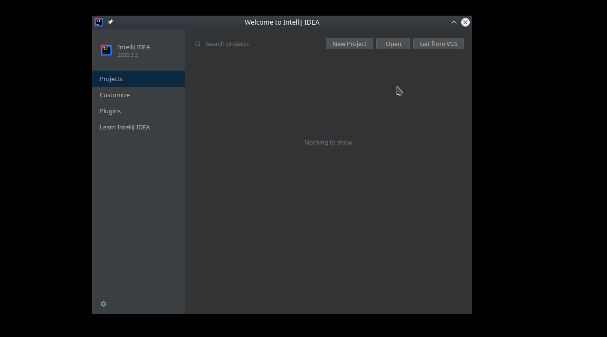

Cvičenie 2
==========

Riešenie [prvého cvičenia](../pu01) odovzdávajte do **štvrtka 3.3. 23:59:59**.

Či ste správne vytvorili pull request (PR) si môžete overiť
v [tomto zozname PR pre pu01](https://github.com/pulls?utf8=%E2%9C%93&q=is%3Aopen+is%3Apr+user%3AFMFI-UK-1-AIN-412+base%3Apu01).

Riešenie tohto cvičenia (úloha [Sudoku](#sudoku)) odovzdávajte
do **štvrtka 3.3. 23:59:59**.

Či ste správne vytvorili pull request si môžete overiť
v [tomto zozname PR pre pu02](https://github.com/pulls?utf8=%E2%9C%93&q=is%3Aopen+is%3Apr+user%3AFMFI-UK-1-AIN-412+base%3Apu02).

Všetky ukážkové a testovacie súbory k tomuto cvičeniu si môžete stiahnuť
ako jeden zip súbor
[pu02.zip](https://github.com/FMFI-UK-1-AIN-412/lpi/archive/pu02.zip).

## Odovzdanie cvičenia 1

Podľa návodu na [odovzdávanie riešení](../../docs/odovzdavanie.md) odovzdajte
riešenie [prvého cvičenia](../pu01). Riešenie odovzdajte do vetvy (branch) `pu01`
v adresári `prakticke/pu01`.

Odovzdajte dva súbory: `spyTheory.txt` ktorý obsahuje „textovú“ verziu vstupu pre SAT solver
(s atómami „`N(M)`“, „`R(M)`“ atď.) obsahujúcu teóriu a `spyGoal.txt` obsahujúci
správne znegované tvrdenie, ktoré chcete dokázať.

## Sudoku

Implementujte triedu `SudokuSolver`, ktorá pomocou SAT solvera rieši sudoku.

Trieda musí mať metódu `solve`, ktorá ako jediný parameter dostane vstupné sudoku:
dvojrozmerné pole 9×9 čísel od 0 po 9, kde 0 znamená prázdne políčko. Metóda vráti ako výsledok
dvojrozmerné pole 9×9 čísel od 1 po 9 reprezentujúce (jedno možné) riešenie vstupného sudoku.

Ak zadanie sudoku nemá riešenie, metóda `solve` vráti dvojrozmerné pole (9×9) obsahujúce samé nuly.

Pri riešení tejto úlohy sa môžete inšpirovať nasledovnými príkladmi:

- [party](../../examples/party/) – úvodný príklad s párty, „ručne“ zapisuje do súboru
  a púšťa SAT solver,
- [N-queens](../../examples/nqueens/) – veľmi podobný príklad ako sudoku (ukladanie dám
  na šachovnicu), používa pomocné knižnice z [examples/sat](../../examples/sat/) na
  zápis DIMACS vstupu a pustenie SAT solvera.

Sudoku:

* štvorcová hracia plocha rozmerov 9×9 rozdelená na 9 podoblastí rozmerov 3×3,
* cieľom je do každého políčka vpísať jednu z číslic 1 až 9,

pričom musíme rešpektovať obmedzenia:

* v stĺpci sa nesmú číslice opakovať,
* v riadku sa nesmú číslice opakovať,
* v každej podoblasti 3×3 sa nesmú číslice opakovať.

*Pomôcka*: Pomocou atómu <code>s(i, j, n)</code> (<code>0
&le; i,j &le; 8</code>, <code>1 &le; n &le; 9</code>) môžeme zakódovať, že na
súradniciach <code>[i,j]</code> je vpísané číslo <code>n</code>.

*Pomôcka 2*: Samozrejme potrebuje zakódovať, že na každej pozícii má byť práve
jedno číslo (t.j. že tam bude aspoň jedno a že tam nebudú dve rôzne).

*Pomôcka 3*: Podmienky nedovoľujúce opakovanie číslic môžeme zapísať vo forme
implikácií: <code>s(i, j, n) -> -s(k, l, n)</code> pre vhodné indexy
<code>i,j,k,l</code>.

*Pomôcka 4*: Pre SAT solver musíme atómy <code>s(i, j, n)</code>
zakódovať na čísla (od 1). <code>s(i, j, n)</code> môžeme zakódovať ako číslo
<code>9 * 9 * i + 9 * j + n</code>, kde <code>0 &le; i,j &le; 8</code>
a <code>1 &le; n &le; 9</code>.

*Pomôcka 5*: Opačná transformácia: SAT solver nám dá číslo <code>x</code>
a chceme vedieť pre aké <code>i, j, n</code> platí <code>x = s(i, j, n)</code>
(napríklad 728 je kódom pre <code>s(8, 8, 8)</code>): keby sme nemali <code>n</code>
od 1, ale od 0 (teda rovnako ako súradnice), bolo by to vlastne to isté ako
zistiť cifry čísla <code>x</code> v deviatkovej sústave. Keďže `n` je od 1, ale
je na mieste „jednotiek“ (t.j. <code>n * 9<sup>0</sup></code>), stačí nám pred
celou operáciou od neho odčítať jedna (a potom zase pripočítať 1 k `n`).

## Technické detaily riešenia

Riešenie odovzdajte do vetvy `pu02` v správnom adresári podľa jazyka,
v ktorom ste ho naprogramovali.

### Python
Odovzdajte súbor `SudokuSolver.py`, v ktorom je implementovaná trieda `SudokuSolver`
obsahujúca metódu `solve`. Metóda `solve` má jediný argument: dvojrozmernú
maticu čísel (zoznam zoznamov čísel) a vracia rovnako dvojrozmernú maticu
čísel.

Program [`sudokuTest.py`](pu02-python/sudokuTest.py) musí korektne zbehnúť s vašou knižnicou
(súborom [`SudokuSolver.py`](pu02-python/SudokuSolver.py), ktorý odovzdáte).

Ak chcete použiť knižnicu z [examples/sat](../../examples/sat), nemusíte si ju
kopírovať do aktuálneho adresára, stačí ak na začiatok svojej knižnice pridáte
```python
import sys
import os
sys.path[0:0] = [os.path.join(sys.path[0], '../../../examples/sat')]
import sat
```

### C++
Odovzdajte súbory `SudokuSolver.h` a `SudokuSolver.cpp`, v ktorých je implementovaná
trieda `SudokuSolver`, ktorá obsahuje metódu `solve` s nasledovnou
deklaráciou:
```C++
std::vector<std::vector<int> > solve(const std::vector<std::vector<int> > &sudoku)
```

Program [`sudokuTest.cpp`](pu02-cpp/sudokuTest.cpp) musí byť skompilovateľný,
keď k nemu priložíte vašu knižnicu (odovzdávané súbory).

### Java
Odovzdajte súbor `SudokuSolver.java` obsahujúci triedu `SudokuSolver`
s metódou `solve` s nasledovnou deklaráciou:

```Java
public static int[][] solve(int[][] sudoku)
```

Program [`SudokuTest.java`](pu02-java/SudokuTest.java) musí byť skompilovateľný,
keď sa k nemu priloží vaša knižnica (odovzdávaný súbor).

Ako si otvoriť javovský projekt v IntelliJ IDEA a spustiť testovací program
si môžete pozrieť na [tomto videu](../../images/lpi-idea-import-and-run.gif):


